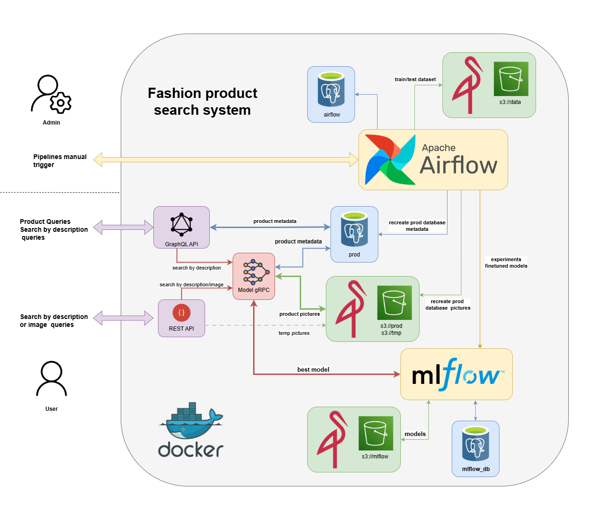

# Ejemplo de Implementación de un Servicio de creación de catálgo de moda para búsqueda.

### MLPOS2 - CEIA - FIUBA

Supongamos que trabajamos para **ML Models and something more Inc.**, la cual ofrece un servicio de creación de
catálogo de productos de moda y de búsqueda avanzada sobre el mismo tanto por texto como por imágenes utilizando el
modelo CLIP-ViT. Internamente, tanto para realizar tareas de DataOps como de MLOps, la empresa cuenta con varios
servicios que ayudan a ejecutar las acciones necesarias. También dispone de un Data Lake en S3, para este caso,
simularemos un S3 utilizando MinIO.

Para simular esta empresa, utilizaremos Docker y, a través de Docker Compose, desplegaremos varios contenedores que
representan distintos servicios en un entorno productivo.

La implementación de ese servicio incluye:

- [Apache Airflow](https://airflow.apache.org/)
    - Un DAG que obtiene datos de un repositorio público o de un repositorio local de productos de moda, realiza
      limpieza y feature engineering y guarda en un bucket s3://data los datos separados para entrenamiento y pruebas.
      MLflow hace seguimiento de este procesamiento.
    - Un DAG que realiza experimentos de fine-tuning del modelo CLIP con el dataset y se calculan métricas obtenidas. Se
      compara el nuevo modelo ajustado con el mejor modelo hasta ahora, y si es mejor, se reemplaza. Todo se lleva a
      cabo siendo registrado en MLflow.
    - Un DAG que recrea la base de datos de producción, descargando datos de un repositorio público, guardando los
      metadatos en una base de datos PostgreSQL (tabla fashion_files) y luego actualizando los embeddings para cada
    - producto utilizando el mejor modelo registrado en MLflow.
- [MLflow](https://mlflow.org/) para llevar registro de los experimentos, datasets y modelos entrenados. En especial 
  para registrar los mejores modelos de finetuned CLIP a ser utilizados en producción y sus métricas.
- GraphQL para realizar consultas de los productos disponibles en PostgreSQL y ejecutar búsquedas por texto mediante
  llamada gRPC al servicio de modelo.
- Rest api para realizar consultas de los productos disponibles en PostgreSQL y ejecutar búsquedas por texto o imágenes
  mediante llamada gRPC al servicio de modelo.
- Servicio de modelo que sirve el mejor modelo registrado en MLflow para realizar búsquedas por texto o imágenes
  mediante llamadas gRPC.
- [MinIO](https://min.io/) para almacenar los buckets.
- Base de datos relacional [PostgreSQL](https://www.postgresql.org/) para almacenar los productos.
- Base de dato key-value [ValKey](https://valkey.io/)
- Aprendizaje federado y seguridad. (TBD según próxima clase)
- Orquestación del servicio en contenedores utilizando Docker.



Por defecto, cuando se inician los multi-contenedores, se crean los siguientes buckets:

- `s3://data` (usado por Airflow para guardar los datos de entrenamiento y pruebas).
- `s3://mlflow` (usada por MLflow para guardar los artefactos).
- `s3://prod` (usada para almacenar las imágenes de la base de datos de producción).
- `s3://tmp` (usada para almacenar temporalmente las imágenes subidas por usuarios al realizar búsquedas de productos
  por imágen).

y las siguientes bases de datos:

- `mlflow_db` (usada por MLflow).
- `airflow` (usada por Airflow).
- `fashion` (usada para almacenar los metadatos de los productos de moda).

## Instalación

1. Para poder levantar todos los servicios, primero instala [Docker](https://docs.docker.com/engine/install/) en tu
   computadora (o en el servidor que desees usar).
2. Clona este repositorio.
3. Si estás en Linux o MacOS, en el archivo `.env`, reemplaza `AIRFLOW_UID` por el de tu usuario o alguno que consideres
   oportuno (para encontrar el UID, usa el comando `id -u <username>`). De lo contrario, Airflow dejará sus carpetas
   internas como root y no podrás subir DAGs (en `airflow/dags`) o plugins, etc.
4. En la carpeta raíz de este repositorio, ejecuta:

```bash
docker compose --profile all up
```

5. Una vez que todos los servicios estén funcionando (verifica con el comando `docker ps -a` que todos los servicios
   estén healthy o revisa en Docker Desktop), podrás acceder a los diferentes servicios mediante:
    - Apache Airflow: http://localhost:18080
    - MLflow: http://localhost:5001
    - MinIO: http://localhost:9001 (ventana de administración de Buckets)
    - Rest API: http://localhost:8800/
    - GraphQL API: http://localhost:8801/.
    - GraphQL API playground: http://localhost:8801/graphql

Si estás usando un servidor externo a tu computadora de trabajo, reemplaza `localhost` por su IP (puede ser una privada
si tu servidor está en tu LAN o una IP pública si no; revisa firewalls u otras reglas que eviten las conexiones).

## Apagar los servicios

Estos servicios ocupan cierta cantidad de memoria RAM y procesamiento, por lo que cuando no se están utilizando, se
recomienda detenerlos. Para hacerlo, ejecuta el siguiente comando:

```bash
docker compose --profile all down
```

Si deseas no solo detenerlos, sino también eliminar toda la infraestructura (liberando espacio en disco), utiliza el
siguiente comando:

```bash
docker compose down --rmi all --volumes
```

Nota: Si haces esto, perderás todo en los buckets y bases de datos.

## Aspectos específicos de Airflow

### Variables de entorno

Airflow ofrece una amplia gama de opciones de configuración. En el archivo `docker-compose.yaml`, dentro de
`x-airflow-common`, se encuentran variables de entorno que pueden modificarse para ajustar la configuración de Airflow.
Pueden añadirse [otras variables](https://airflow.apache.org/docs/apache-airflow/stable/configurations-ref.html).

### Uso de ejecutores externos

Actualmente, para este caso, Airflow utiliza un
ejecutor [celery](https://airflow.apache.org/docs/apache-airflow/stable/core-concepts/executor/celery.html), lo que
significa que las tareas se ejecutan en otro contenedor.

### Uso de la CLI de Airflow

Si necesitan depurar Apache Airflow, pueden utilizar la CLI de Apache Airflow de la siguiente manera:

```bash
docker compose --profile all --profile debug up
```

Una vez que el contenedor esté en funcionamiento, pueden utilizar la CLI de Airflow de la siguiente manera,
por ejemplo, para ver la configuración:

```bash
docker-compose run airflow-cli config list      
```

Para obtener más información sobre el comando, pueden
consultar [aqui](https://airflow.apache.org/docs/apache-airflow/stable/cli-and-env-variables-ref.html).

### Variables y Conexiones

Si desean agregar variables para accederlas en los DAGs, pueden hacerlo en `secrets/variables.yaml`. Para obtener
más [información](https://airflow.apache.org/docs/apache-airflow/stable/core-concepts/variables.html),
consulten la documentación.

Si desean agregar conexiones en Airflow, pueden hacerlo en `secrets/connections.yaml`. También es posible agregarlas
mediante la interfaz de usuario (UI), pero estas no persistirán si se borra todo. Por otro lado, cualquier conexión
guardada en `secrets/connections.yaml` no aparecerá en la UI, aunque eso no significa que no exista. Consulten la
documentación para obtener más
[información](https://airflow.apache.org/docs/apache-airflow/stable/authoring-and-scheduling/connections.html).

## Conexión con los buckets

Dado que no estamos utilizando Amazon S3, sino una implementación local de los mismos mediante MinIO, es necesario
modificar las variables de entorno para conectar con el servicio de MinIO. Las variables de entorno son las siguientes:

```bash
AWS_ACCESS_KEY_ID=minio   
AWS_SECRET_ACCESS_KEY=minio123 
AWS_ENDPOINT_URL_S3=http://localhost:90000
```

MLflow también tiene una variable de entorno que afecta su conexión a los buckets:

```bash
MLFLOW_S3_ENDPOINT_URL=http://localhost:9000
```

Asegúrate de establecer estas variables de entorno antes de ejecutar tu notebook o scripts en tu máquina o en cualquier
otro lugar. Si estás utilizando un servidor externo a tu computadora de trabajo, reemplaza localhost por su dirección
IP.

Al hacer esto, podrás utilizar `boto3`, `awswrangler`, etc., en Python con estos buckets, o `awscli` en la consola.

Si tienes acceso a AWS S3, ten mucho cuidado de no reemplazar tus credenciales de AWS. Si usas las variables de entorno,
no tendrás problemas.

## Valkey

La base de datos Valkey es usada por Apache Airflow para su funcionamiento. Tal como está configurado ahora no esta
expuesto el puerto para poder ser usado externamente. Se puede modificar el archivo `docker-compose.yaml` para
habilitaro.

## Actualizaciones

Para utilizar este repositorio y cargar datos del dataset `ashraq/fashion-product-images-small`, se puede ejecutar el
siguiente comando:

```bash
poetry run python src/data/dataset_loader.py
```

Este script realiza las siguientes tareas:

- Descarga un conjunto de imágenes del dataset desde Hugging Face.
- Guarda las imágenes en un bucket S3 utilizando MinIO como almacenamiento.
- Genera un índice en PostgreSQL, preservando las columnas originales del dataset y agregando campos adicionales de
  metadatos.

---

### Verificar los datos indexados en PostgreSQL

Una vez ejecutado el script, se puede consultar el índice generado en PostgreSQL con:

```bash
psql -h localhost -p 15432 -U airflow -d airflow
```

Y luego ejecutar la siguiente consulta SQL:

```sql
SELECT * FROM fashion_files LIMIT 5;
```

---

### Instalación de `psql` en macOS

Para poder ejecutar `psql`, es necesario tenerlo instalado. En macOS, se puede instalar con:

```bash
brew install libpq
```

Como `libpq` es un paquete *keg-only*, no se agrega automáticamente al `PATH`. Para solucionarlo, se debe ejecutar:

```bash
echo 'export PATH="/opt/homebrew/opt/libpq/bin:$PATH"' >> ~/.zshrc
source ~/.zshrc
```

Verificá que haya quedado correctamente configurado con:

```bash
which psql
psql --version
```

La salida esperada debería ser similar a:

```
/opt/homebrew/opt/libpq/bin/psql
psql (PostgreSQL) 17.5
```

Con esto ya podés volver a ejecutar el comando `psql` y realizar consultas sobre la tabla `fashion_files`.

## API GraphQL

Este proyecto expone una API GraphQL desarrollada con **Strawberry** y **FastAPI**, que permite consultar los metadatos
de los archivos indexados del dataset `ashraq/fashion-product-images-small`.

### 🔌 Consultar la API

Docker levantará la API en el puerto 8801:8801. Accediendo al endpoint `/graphql` se podrán ejecutar consultas usando la
UI.

---

### 📋 Queries disponibles

#### 🔹 `allFiles`

Devuelve todos los registros indexados (limitado por defecto en el backend).

```graphql
{
  allFiles {
    id
    filename
    gender
    masterCategory
    baseColour
  }
}
```

---

#### 🔹 `filesByFilters(...)`

Consulta flexible con múltiples filtros opcionales y paginación:

**Parámetros disponibles:**

- `masterCategory` (String)
- `gender` (String)
- `baseColour` (String)
- `season` (String)
- `year` (String)
- `limit` (Int, por defecto: 50)
- `offset` (Int, por defecto: 0)

**Ejemplos:**

```graphql
{
  filesByFilters(gender: "Women", season: "Winter", limit: 10) {
    id
    filename
    productDisplayName
  }
}
```

---

#### 🔹 `search(...)`

Realiza una búsqueda avanzada por texto de productos de modda, retornando los productos que más coincidan con la
descripción ingresada.

**Parámetros disponibles:**

- `description` (String)
-

**Ejemplos:**

```graphql
mutation{
  search(description:"soccer jersey"){
    id
    filename
    productDisplayName
  }
}
```

---

### 📦 Campos disponibles en cada archivo (`FashionFile`)

- `id`
- `filename`
- `s3Path`
- `masterCategory`
- `subCategory`
- `articleType`
- `baseColour`
- `season`
- `year`
- `usage`
- `gender`
- `productDisplayName`
- `dataset`
- `created_at`

---

> 💡 Nota: los archivos físicos están almacenados en un bucket S3 (MinIO), y los campos representan metadatos extraídos
> al momento de la carga del dataset.

## API REST

Este proyecto expone una API REST desarrollada con **FastAPI**, que permite realizar búsquedas de productos de moda
tanto por texto como por imágenes.

### 🔌 Consultar la API

Docker levantará la API en el puerto 8800. Debe utilizarse comando curl o postman para realizar las consultas.

---

### 📋 Queries disponibles

#### 🔹 `POST /search/description`

Realiza una búsqueda avanzada por texto de productos de moda, retornando los productos que más coincidan con la
descripción ingresada.

```commandline
curl --location 'http://localhost:8800/search/description' \
    --header 'Content-Type: application/json' \
    --data '{"description": "white shoes"}'
```

---

#### 🔹 `POST /search/image`

Realiza una búsqueda avanzada por imagen de productos de moda, retornando los productos que más coincidan con la imágen
ingresada. Para este endpoint, la imágen es temporalmente subida a s3 previo a realizar la búsqueda.

**Ejemplos:**

```commandline
curl --location 'http://localhost:8800/search/image' \
    --header 'Content-Type: image/png' \
    --data-binary '/home/user/img.png'
```

---

### 📦 Campos disponibles

Los campos disponibles en la API REST coinciden con los de la API GraphQL.

## Interfaz de Usuario con Streamlit

Este proyecto incluye una interfaz de usuario interactiva desarrollada con Streamlit que permite realizar búsquedas de productos de moda tanto por texto como por imágenes de manera sencilla.

### 🔍 Características

- Búsqueda por descripción de texto
- Búsqueda por imágenes
- Soporte para API REST y GraphQL
- Visualización de resultados con imágenes y detalles del producto
- Interfaz intuitiva y fácil de usar

### 🚀 Cómo ejecutar la aplicación Streamlit

1. Asegúrate de que los servicios de backend estén en ejecución (ver sección de Instalación).

2. Navega hasta el directorio raíz del proyecto:
   ```bash
   cd ruta/al/proyecto/amq2-service-ml
   ```

3. Instala las dependencias necesarias (si aún no lo has hecho):
   ```bash
   poetry install
   ```

4. Ejecuta la aplicación Streamlit:
   ```bash
   poetry run streamlit run src/ui/app.py
   ```

5. La aplicación se abrirá automáticamente en tu navegador predeterminado en `http://localhost:8501`.

### ⚙️ Configuración

La aplicación Streamlit se conecta por defecto a los siguientes servicios:
- API REST: `http://localhost:8800`
- API GraphQL: `http://localhost:8801/graphql`

Puedes modificar estas URLs desde la interfaz de usuario en la barra lateral si es necesario.

### 📱 Uso

1. **Selecciona el tipo de API** (REST o GraphQL) en la barra lateral.
2. **Elige el modo de búsqueda**:
   - **Texto**: Ingresa una descripción del producto que estás buscando.
   - **Imagen**: Sube una imagen para encontrar productos visualmente similares.
3. Haz clic en "Search" y explora los resultados.